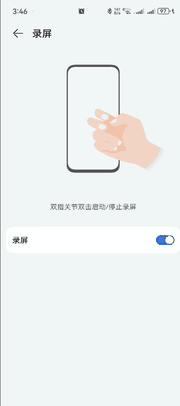

# 微信bug消息编辑器

### 👉 [点击这里在线使用](https://www.cc11001100.com/wx-bug-editor/) 👈

这是一个用于生成特殊微信消息格式的编辑器工具，可以创建以下类型的消息：

1. 强制好友发送指定的文本消息
2. 强制好友打语音电话

## 演示效果

[](https://cc11001100.github.io/wx-bug-editor/demo.mp4)

## 功能特点

- 简洁直观的用户界面
- 实时消息预览
- 一键复制生成的消息内容
- 支持不同类型的消息格式

## 使用方法

1. 选择需要的消息类型
2. 输入相应的消息内容或微信号
3. 查看预览区域的消息格式
4. 点击"复制消息内容"按钮复制生成的内容
5. 将内容粘贴到微信中使用

## 技术栈

- React
- TypeScript
- Vite

## 开发

```bash
# 安装依赖
npm install

# 启动开发服务器
npm run dev

# 构建生产版本
npm run build
```

## 注意事项

本工具仅供学习和研究目的，请勿用于非法用途。使用本工具生成的消息可能会被微信官方视为违规行为，请自行承担使用风险。
